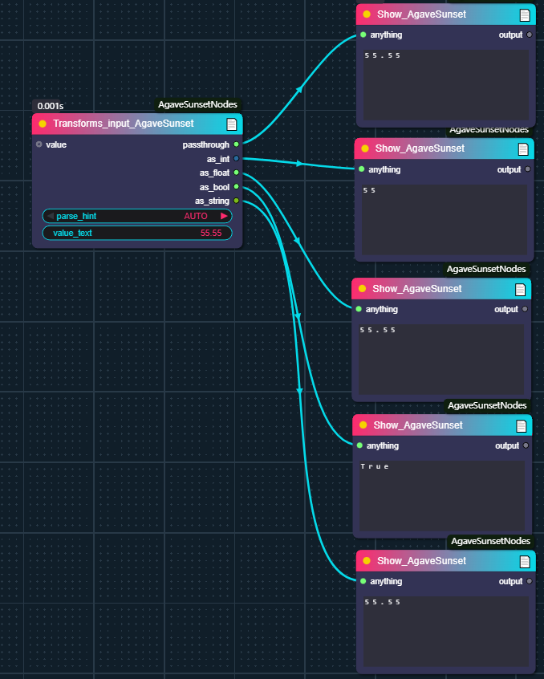
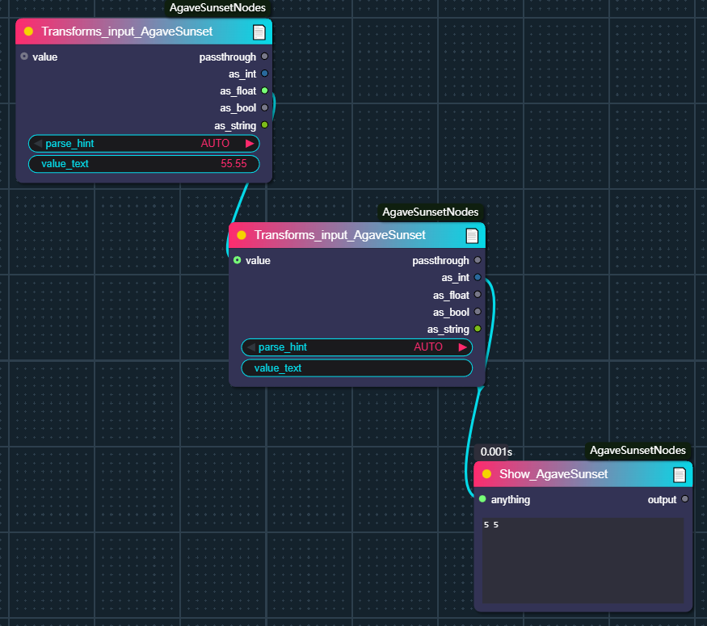
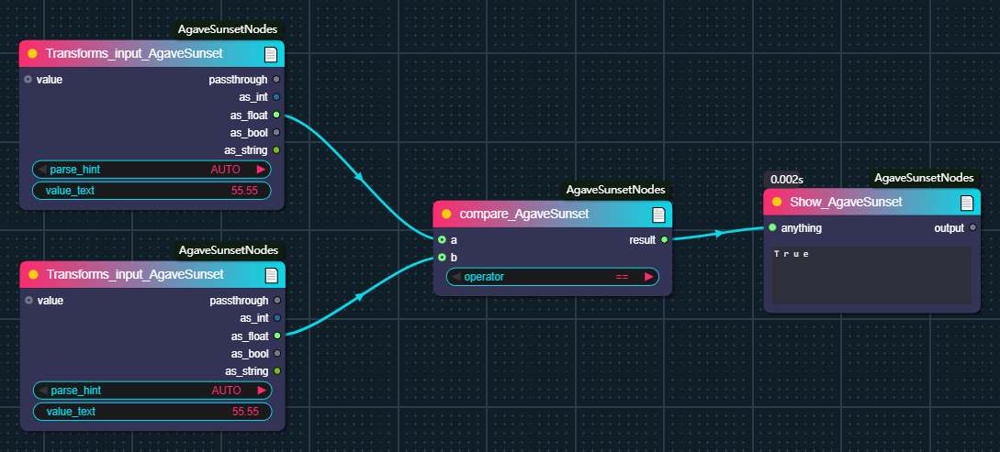
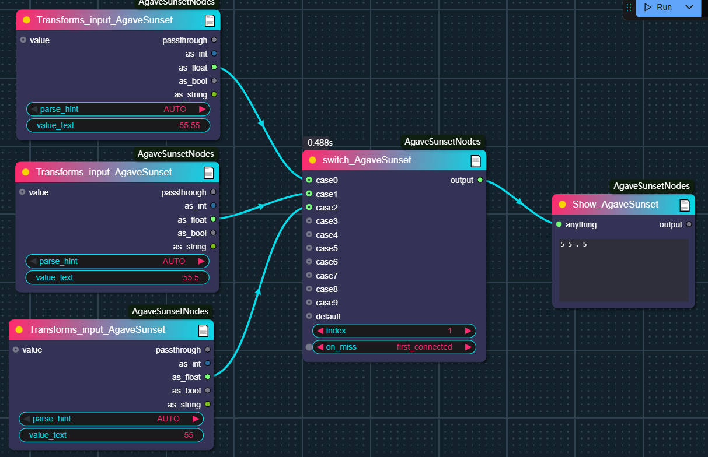
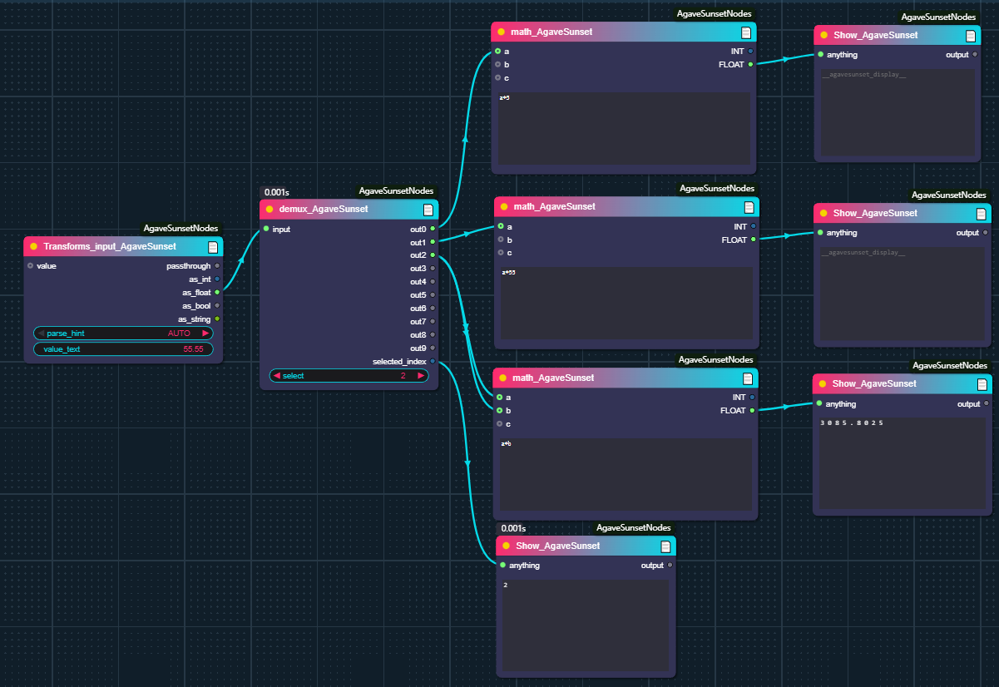

# Conventional Mathematics and Logic
There are currently five nodes in total, and flexible logical operations can be performed by using them in combination.
## How to use them
### Show_AgaveSunset : 
Used to display four types of values.
  

### Transforms_input_AgaveSunset : 
Used for manually or automatically selecting the output type or performing value type conversion.If automatic selection is chosen, the "passthrough" needs to be selected as the output port.
 

### compare_AgaveSunset : 
Used for performing common size comparisons and outputting boolean values.
 

### switch_AgaveSunset : 
It is used for selecting among multiple input values. If any of the input ports are connected, using "first_connected" will access the first value from top to bottom, while "last_connected" functions in the opposite way.
 

### demux_AgaveSunset : 
It is used for selecting among multiple output routes, and only the route you select will be executed.
 

### math_AgaveSunset : 
Used to execute manually entered expressions.
  

###Help
The implementation of some code references "Show Text 🐍" and "Math Expression 🐍" from the custom-scripts plugin.
